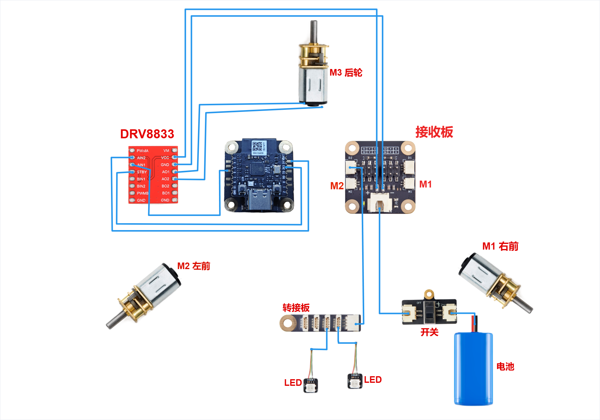
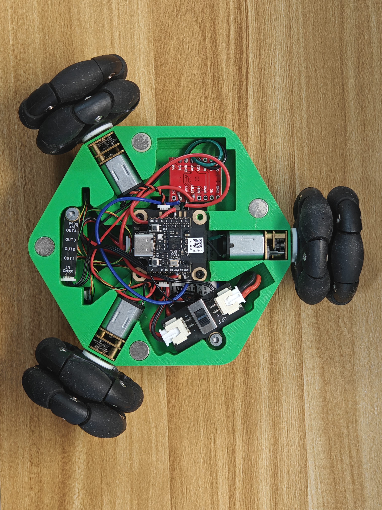

# 接线：两台接接收板，第三台接 DRV8833

**灯光连接：LED 转接板的 IN 接接收板 D2 槽，两颗 LED 分别插在转接板输出端。接线图已更新为 D2，沿用现有实车固件。**

作者最新图采用 **M1 = 右前、M2 = 左前、M3 = 后轮** 的标注。App 内的逻辑轮位可能与物理端口名不同，复刻时用标定向导把实际端口映射到对应轮位，不要仅凭 M1/M2 的名称判断左右。

| 连接关系 | 用途 |
|---|---|
| 接收板 M1 → 图示右前电机 | 板载第一路电机输出 |
| 接收板 M2 → 图示左前电机 | 板载第二路电机输出 |
| GPIO21 → 外接板 AIN1，GPIO20 → AIN2 | 配套主固件的第三电机控制输入 |
| 外接板 AO1 / AO2 → M3 后轮电机两焊片 | 第三电机输出；方向通过标定确认 |
| 开关串在电池与接收板供电之间 | 整车主电源控制 |
| 电机电源 → 驱动板 VM；各模块 GND 共地 | 驱动供电和信号参考 |
| 灯转接板 OUT → 两颗 RGB LED | 两盏前灯输出 |
| **接收板 D2 槽 → 灯转接板 IN** | 按作者实车确认的接法，沿用现有固件；灯供电和地线按模块实际针序连接 |

**驱动板针脚需要与购买的实际模块核对：**

- 红板素材带有 `PWMA / PWMB / VCC` 丝印，而先前实车照片相应位置为 `NC`。不能把图上同一位置的焊盘名称直接当成任意 DRV8833 模块的定义，尤其要核对 **VM、电源地、休眠/使能端**；图中未明确的 VM 供电还需补齐。

DRV8833 芯片采用双 H 桥和 `nSLEEP` 休眠控制，具体模块可能采用不同引出名称或板载接法；不能把 `STBY` 当成所有模块都通用的引脚定义。芯片定义可查 [TI 官方 DRV8833 页面及数据手册](https://www.ti.com/product/DRV8833)。

电池标称 7.4 V 不等于电机得到 6 V，也不等于灯模块需要的电压；按实车供电方案核对各输出。首次通电前检查极性、共地、焊点和供电，再架空运行单轮测试。
