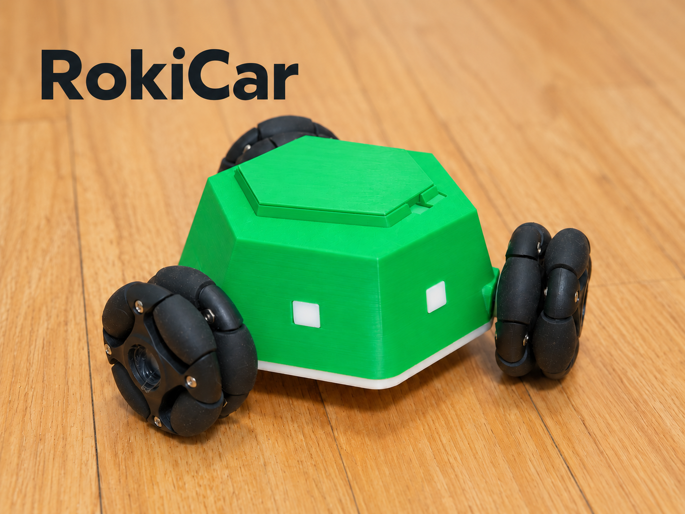

# RokiCar｜把三只轮子，玩成更多方向

资料更新：2026-10-08。外壳与顶盖按 **RokiCar V8** 整理，软件仍使用 Android 1.22.0 与配套实车固件。

**一台可以横着走、原地转，也可以带着相机换个视角看世界的三轮全向小车。**

普通小车要先转弯再换方向，RokiCar 可以直接向侧面平移。三只全向轮配合独立电机控制，让前进、后退、横移和原地旋转出现在同一个小底盘上。装好它，你可以先拿手机玩起来，再慢慢研究它为什么能这样移动。

绿色六边形车身、黑色全向轮和两盏前灯，是 RokiCar 的样子；可打印外壳、可修改的模型、手机 App 和 MicroPython 程序，则是继续改造它的入口。你可以复刻一台，也可以把它做成自己的版本。
