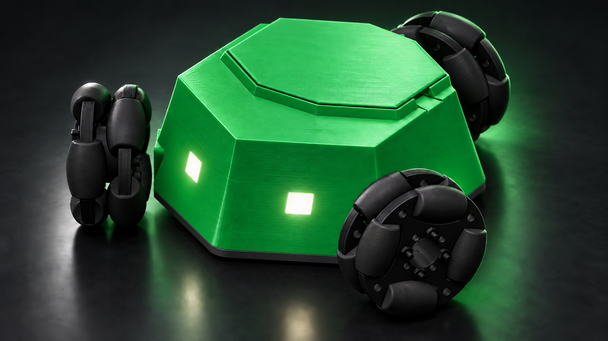
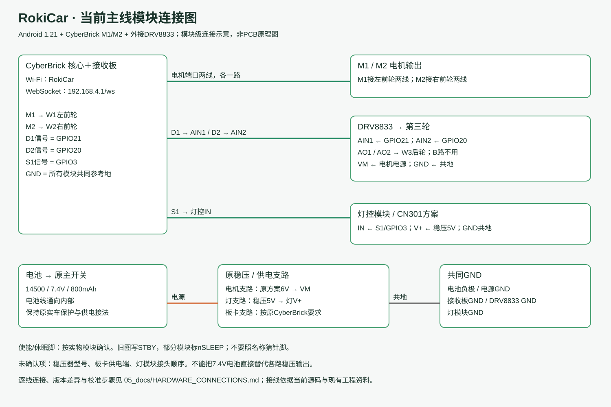
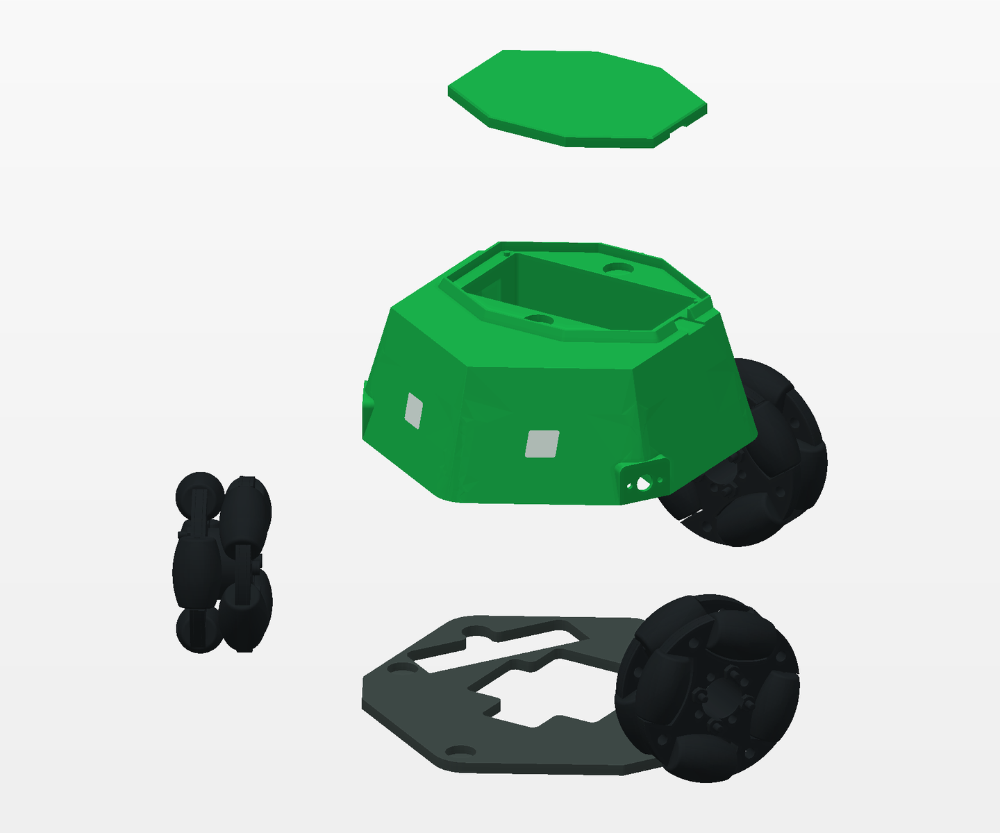

# RokiCar · 洛奇小车

**三轮全向移动，六边形车身，可打印、可改造的小型机器人。**

RokiCar 是本项目的正式名称。绿色外壳与黑色轮组搭配，低矮磁吸顶盖便于电池检修；未来可通过专用顶盖探索相机、传感器等扩展。

本资料包：2026-09-16；模型：用户确认的V7；手机端：RokiCar Android 1.22.0。远程仓库当前保持私有。

## 先看这几份

1. [快速开始](05_docs/QUICK_START.md)：从下载到首次架空测试。
2. [项目完整手册](RokiCar_项目手册.md)：集中阅读项目、硬件、打印、软件与后续开发。
3. [MakerWorld发布文案](05_docs/MAKERWORLD_DESCRIPTION.md)：可复制到作品详情。
4. [发布文件清单](05_docs/PUBLISH_FILES.md)：模型、图片和资料附件分别在哪里。

## 文档导航

| 内容 | 文档 |
|---|---|
| 项目定位、结构与版本 | [项目总览](05_docs/PROJECT_OVERVIEW.md) |
| 零件与待确认规格 | [BOM](05_docs/BOM.md) |
| 打印方向、磁铁、装配 | [打印与装配](05_docs/PRINT_AND_ASSEMBLY.md) |
| 模块电路连接与供电 | [硬件接线](05_docs/HARDWARE_CONNECTIONS.md) |
| APK、源码、固件与校准 | [软件指南](05_docs/SOFTWARE_GUIDE.md) |
| 已有、实验与计划功能 | [功能状态与路线图](05_docs/FEATURES_AND_ROADMAP.md) |
| 相机顶盖未来方向 | [扩展设计](05_docs/EXPANSION.md) |
| 故障排查与反馈 | [故障排查](05_docs/TROUBLESHOOTING.md) |
| 名称与软件兼容性 | [命名说明](05_docs/NAMING.md) |

## 模型与软件

- `01_model/cad/03_shell_assembly.step`：V7车壳＋顶盖。
- `01_model/cad/04_original_base.step`：原底壳。
- `01_model/print/`：新车壳、顶盖和磁铁试配块STL。
- `01_model/reference/original_full_assembly.step`：原整车装配参考，仍含旧壳；不是V7完整整车装配。
- `02_software/android_apk/RokiCar-Controller-v1.22-debug.apk`：重新构建的控制器安装包。
- `02_software/mobile/rokicar-android/`：当前原生Android源码。
- `02_software/firmware/cyberbrick_rokicar_m1m2_plus_drv8833/`：当前主固件。
- `02_software/lessons/`、`simulator/`：运动学教程与模拟器。

## 硬件连接

现有资料提供模块级连接图与逐线表，没有自制PCB原理图/Gerber。稳压器型号、部分供电接口和灯模块端子顺序仍待实车补充。旧双DRV8833方案仅作历史参考，不要与当前M1/M2＋单DRV8833主线混接。

## 机械结构

图中为真实模型的顶盖、车壳、底盖和轮组，未展示电子板、电池和线束。宣传图的底盖已作合拢表现；原参考装配体底板存在向下偏移，实际装配需核对定位。V7零件未因宣传图而修改。

## 目前做到哪里

已有：V7模型、手机操控与校准源码、灯控源码、固件、接线资料。基础模型干涉、指甲进入通道、STL封闭性检查通过；Android 1.22.0 已重新构建并通过软件测试，仍需实车验收。

实验：RSSI辅助返航、开环航向估算。待开发：相机磁吸一体顶盖、云台/图传、视觉、定位闭环；AI页在1.22中显示待开发。

已撤下被否定的相机/云台渲染图，当前发布包不含这些概念图。透明背景素材未成功生成，也未作为透明PNG交付。

## 使用与贡献

原创内容采用[MIT许可](LICENSE)，第三方组件保持各自条款，见[第三方说明](THIRD_PARTY.md)。欢迎反馈打印配合、接线纠正、兼容性和功能建议；请附版本、硬件型号、照片和复现步骤。
