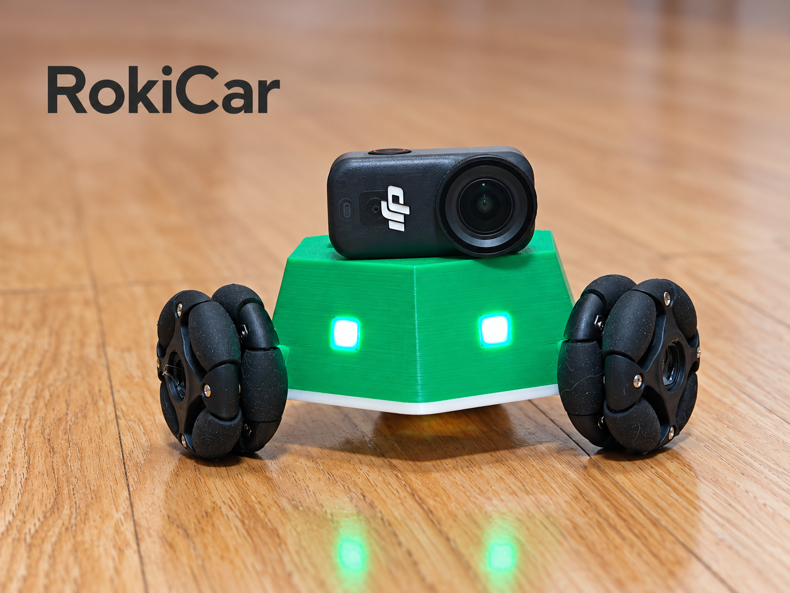

# RokiCar

**三轮全向移动，六边形车身，可打印、可改造的小型机器人。**

当前：V8 外壳与顶盖、Android 1.22.0、三文件 MicroPython 程序。仓库公开，更新日期 2026-10-08。内部结构和轮组不变；顶盖取消定位销，保留一组磁吸。

## 下载与复刻

- [最新 Release / 全部附件](https://github.com/yinbaozong/RokiCar/releases/latest)
- [复刻指南 PDF](05_docs/RokiCar_复刻指南.pdf)：元器件、图片、装配、AI 刷写和首次校准。
- [Android APK 直接下载](https://github.com/yinbaozong/RokiCar/releases/latest/download/RokiCar-Controller-v1.22-debug.apk)
- [Roki 固件 ZIP](https://github.com/yinbaozong/RokiCar/releases/latest/download/RokiCar-Firmware-20261008.zip)
- [V8 模型 ZIP](https://github.com/yinbaozong/RokiCar/releases/latest/download/RokiCar-V8-Models.zip)
- [快速开始](05_docs/QUICK_START.md) · [物料与采购链接](05_docs/BOM.md) · [打印装配](05_docs/PRINT_AND_ASSEMBLY.md)

优先将固件交给能够访问本机终端和 USB 串口的 AI，例如 Codex、Claude Code、Trae、WorkBuddy，或 DeepSeek 搭配本地 Agent/Harness。安装 Python 和 mpremote，交给 AI 备份、上传、回读校验；用户确认重启和实车动作。详见 [刷写教程](05_docs/用户刷写教程.md) 和 [AI 提示词](05_docs/交给AI刷写.txt)。

## 最新机械与物料

- 车壳、顶盖：01_model/cad、01_model/print；原底壳为 01_model/cad/04_original_base.step。
- 顶盖每侧间隙 0.40 mm，围边厚 1.60 mm，无定位销。
- Ø8×2 mm 磁铁整车 10 颗：顶盖一组 2 颗、底壳四组 8 颗。
- N20 电机：6 V / 200 rpm，3 台；47 mm 全向轮 3 只；DRV8833 1 块。
- 电机螺丝 M1.6×3 mm 共 6 颗；BT 自攻规格为按孔位提出的试配建议，见 BOM。

## 最新接线与图片

M1 右前、M2 左前、M3 后轮；LED 转接板 IN 接 D2，作者确认正常，固件灯控定义保持原样。逐项连接与电源说明见 [硬件接线](05_docs/HARDWARE_CONNECTIONS.md)。旧 SVG 和旧双驱动资料仅作学习参考。

相机为额外配件，未交付图传、云台或专用磁吸相机支架。基础功能和实验功能见 [功能状态](05_docs/FEATURES_AND_ROADMAP.md)。

## 文档与验证

[项目手册](RokiCar_项目手册.md) · [MakerWorld 正文](05_docs/MAKERWORLD_DESCRIPTION.md) · [软件指南](05_docs/SOFTWARE_GUIDE.md) · [发布清单](05_docs/PUBLISH_FILES.md)

V8 几何与打印网格检查已记录在 01_model/docs。启动文件回归、语法与依赖检查通过；APK 使用既有 1.22.0 文件。本轮没有实车刷写或重新试打，按 PDF 完成文件回读、重启与架空校准后再低速落地。

原创内容采用 [MIT](LICENSE)，第三方组件见 [说明](THIRD_PARTY.md)。欢迎反馈打印配合、接线、兼容性和改造经验。
